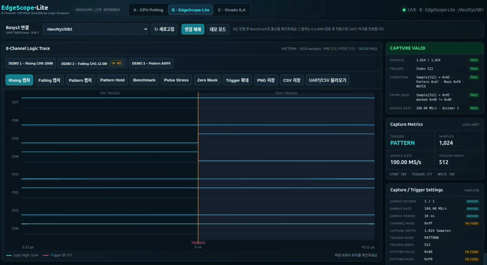
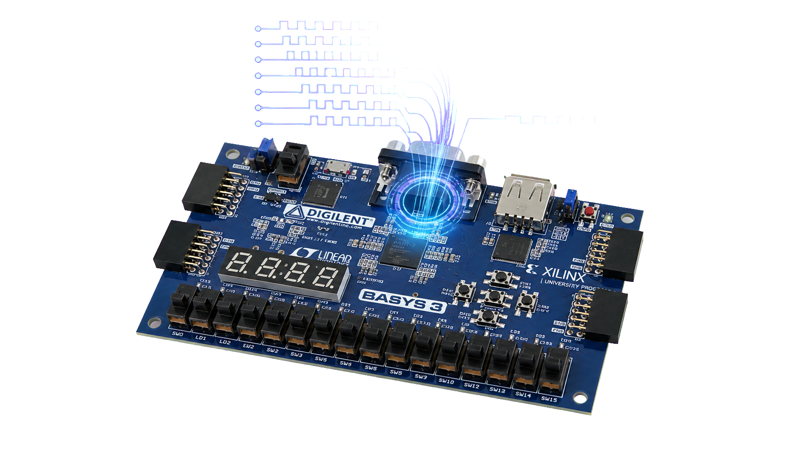
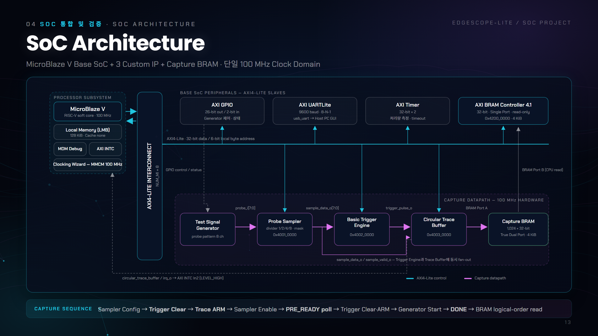
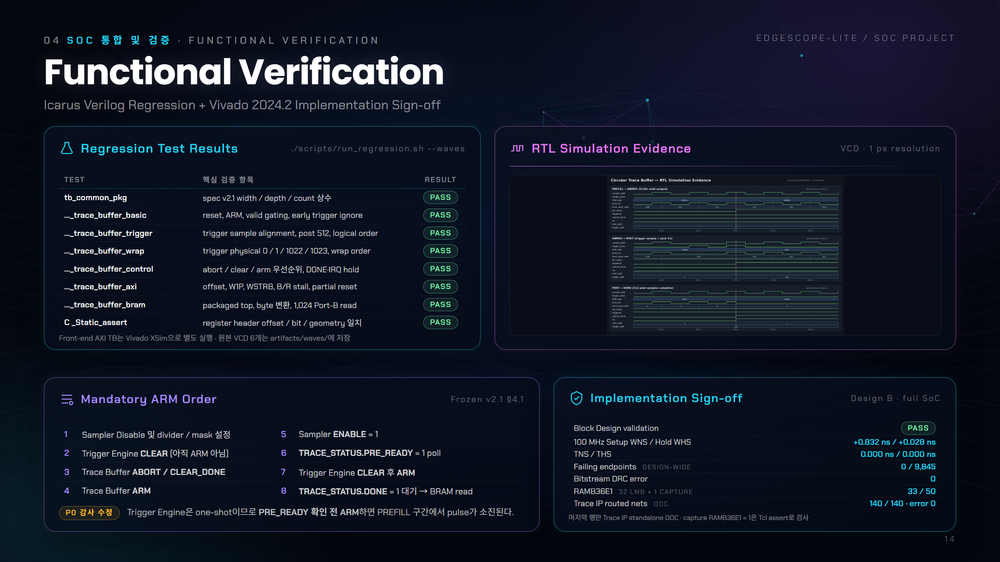

<div align="center">

# 🔬 EdgeScope-Lite SoC

### 8-Channel Hardware Logic Analyzer · Custom IP Design · MicroBlaze V SoC Integration

<p>
  
  
  
  
  
  
</p>

<p>
  
  &nbsp;
  
</p>

<sub>
왼쪽 — Basys3 실측 캡처 화면 · <code>LIVE</code> UART · Pattern 트리거 · <code>CAPTURE VALID</code> 전 항목 PASS<br>
오른쪽 — Basys3 (Artix-7 XC7A35T) 타깃 보드
</sub>

**Basys3(Artix-7) 위에 직접 설계한 Custom IP 3종으로, CPU 개입 없이 100 MHz 등간격 8채널 샘플링과 트리거 중심 1,024 샘플 캡처를 구현한 SoC 프로젝트입니다.**

[▶ 시연 영상 (1:57)](https://youtu.be/T0j1yjTDdGs) &nbsp;·&nbsp; [원본 팀 저장소](https://github.com/yoon3226/EdgeScope-Lite-SoC)

</div>

---

## 1. Project Overview

로직 애널라이저를 소프트웨어로 구현하면 MicroBlaze가 AXI GPIO를 반복해서 읽어야 합니다. 이 방식은 처리량이 낮을 뿐 아니라 **샘플 간격이 소프트웨어 스케줄에 좌우되어 등간격이 아니고**, 짧은 펄스는 폴링과 폴링 사이에서 사라집니다.

EdgeScope-Lite는 관측 경로에서 CPU를 완전히 걷어냅니다. Probe Sampler, Basic Trigger Engine, Circular Trace Buffer 세 IP를 RTL로 직접 설계하고 MicroBlaze V 기반 SoC에 통합해, **CPU는 AXI4-Lite로 설정하고 결과를 읽을 뿐 캡처 데이터패스에는 관여하지 않도록** 만들었습니다.

| 항목 | 내용 |
|---|---|
| 프로젝트 형태 | 팀 프로젝트 (3인) · 온디바이스 AI 반도체 설계 3기 |
| 담당 범위 | **Probe Sampler IP 설계, Vivado HW Platform(Block Design) 통합, Bitstream·XSA 및 구현 리포트 산출** |
| FPGA | Digilent Basys3 · Xilinx Artix-7 (XC7A35T) |
| CPU | MicroBlaze V (RISC-V soft core) · 100 MHz · LMB 128 KiB · 캐시 없음 |
| HDL | SystemVerilog, Verilog |
| Language | C (Vitis firmware), Python (GUI), Tcl (build) |
| Development | Vivado 2024.2, Vitis 2024.2, Icarus Verilog, Vivado XSim |
| 주요 인터페이스 | AXI4-Lite, True Dual-Port BRAM, UART 9600 bps, GPIO, Interrupt |
| 검증 | RTL 회귀 8/8 PASS · Implementation Sign-off WNS +0.832 ns |

### 팀 구성과 담당

| 팀원 | 담당 IP · 범위 |
|---|---|
| **김도근** | **Probe Sampler IP · Vivado HW Platform 통합 · Bitstream/XSA/구현 리포트** |
| 국승호 | Basic Trigger Engine IP · MicroBlaze 임베디드 소프트웨어 · UART 출력 |
| 윤형욱 | Circular Trace Buffer IP · Dual-Port BRAM 캡처 경로 |

> 본 저장소는 팀 산출물 전체를 포함하되 **김도근 담당 범위를 중심으로 재구성한 개인 포트폴리오본**입니다.
> 원본 팀 README는 [`docs/original_team_readme.md`](./docs/original_team_readme.md)에 보존했습니다.

---

## 2. Key Features

| 기능 | 구현 내용 |
|---|---|
| **CPU-Free Capture Datapath** | 캡처 경로 전체가 100 MHz 하드웨어 · CPU는 설정과 읽기만 담당 |
| **8-Channel 100 MS/s Sampling** | 8비트 병렬 스냅샷, Divider 1/2/4/8로 100 / 50 / 25 / 12.5 MS/s |
| **Single Clock Domain** | 분주 클럭을 만들지 않고 clock-enable로 구현해 CDC와 타이밍 제약 제거 |
| **Trigger-Centered Capture** | pre-trigger 512 + 트리거 포함 post 512 · **트리거 논리 인덱스 항상 512 고정** |
| **3 Trigger Modes** | Rising Edge, Falling Edge, Masked Pattern |
| **Independent AXI4-Lite CSR** | 세 IP가 각자 독립 base address와 레지스터 맵 보유 |
| **True Dual-Port Capture BRAM** | Port A는 하드웨어 write 전용, Port B는 CPU read 전용으로 물리 분리 |
| **Interrupt-Driven Completion** | 캡처 완료를 `irq_o` LEVEL_HIGH로 AXI INTC에 전달 |
| **HW/SW Contract Enforcement** | C 헤더와 RTL 레지스터 오프셋 불일치 시 **컴파일 실패** |
| **Reproducible Build** | GUI 조작 없이 Tcl batch만으로 XSA·Bitstream 전체 재생성 |
| **A/B/C Benchmark** | 동일 Base SoC 위에서 CPU Polling · EdgeScope-Lite · Vivado ILA 3자 비교 |

---

## 3. Motivation — 소프트웨어 관측의 한계

| | A. CPU Polling | **B. EdgeScope-Lite** | C. Vivado ILA |
|---|---:|---:|---:|
| 샘플링 주체 | MicroBlaze 소프트웨어 | **전용 FPGA 하드웨어** | Xilinx 디버그 IP |
| 샘플 레이트 | 1.67 MS/s (비등간격) | **100 MS/s (등간격)** | 100 MS/s |
| 10 ns 펄스 검출 | 0 / 10 | 검출 | 검출 |
| 100 ns 펄스 검출 | 0 / 10 | 검출 | 검출 |
| 1 µs 이상 펄스 | 10 / 10 | 검출 | 검출 |
| pre-trigger 이력 | 없음 | **512 샘플 보존** | 512 샘플 |
| 결과 확인 경로 | UART | **UART · CSV (독립 실행)** | Vivado Hardware Manager 필요 |

CPU 폴링은 1 µs 이상 펄스만 안정적으로 잡습니다. 폴링 간격보다 짧은 사건은 관측 자체가 불가능하고, 사건이 발생한 **이전 시점의 이력**도 남지 않습니다. EdgeScope-Lite는 두 문제를 하드웨어 링버퍼로 동시에 해결합니다.

---

## 4. System Architecture

<p align="center">
  
</p>

<p align="center">
  <sub>
    MicroBlaze V Base SoC + Custom IP 3종 + Capture BRAM · 단일 100 MHz Clock Domain<br>
    파란 선은 AXI4-Lite 제어 경로, 분홍 선은 CPU가 개입하지 않는 100 MHz 캡처 데이터패스
  </sub>
</p>

### Datapath

```text
Test Signal Generator ──probe_i[7:0]──▶ Probe Sampler
                                            │
                        sample_data_o[7:0] / sample_valid_o
                                            │
                          ┌─────────────────┴─────────────────┐
                          ▼                                   ▼
                  Basic Trigger Engine ──trigger_pulse_o──▶ Circular Trace Buffer
                                                                  │  BRAM Port A (write)
                                                                  ▼
                                                            Capture BRAM
                                                          1,024 × 32-bit TDP
                                                                  │  BRAM Port B (read)
                                                                  ▼
                                                       AXI BRAM Controller ──▶ MicroBlaze V
```

Sampler 출력이 Trigger와 Buffer로 **fan-out** 되었다가 trigger pulse가 다시 Buffer로 들어오는 구조입니다. 세 IP 모두 같은 100 MHz 클럭에서 동작하며 `sample_valid_o`를 공통 타이밍 기준으로 사용합니다.

### Frozen Specification v2.1

- 8-bit probe · 100 MHz · Divider 1 / 2 / 4 / 8
- Rising / Falling / Masked Pattern 트리거 중 하나
- 1,024 × 32-bit True Dual-Port BRAM
- pre-trigger 512 + 트리거 포함 post 512 → **트리거 논리 인덱스 512 고정**
- IP별 독립 AXI4-Lite base address

전체 명세는 [`docs/day1_common_spec.md`](./docs/day1_common_spec.md)에 동결되어 있습니다.

---

## 5. Probe Sampler IP — 담당 파트 ①

> 모든 샘플 타이밍의 기준을 만드는 입력단 IP입니다. Trigger Engine과 Trace Buffer가 이 IP의 `sample_valid_o`를 공통 기준으로 사용하므로, 여기서 타이밍이 흔들리면 하위 두 IP가 모두 어긋납니다.

### 5.1 설계 판단 — 분주 클럭을 만들지 않는다

1/2/4/8 분주가 필요하다고 해서 **새 클럭을 생성하지 않았습니다.** 100 MHz 단일 클럭 안에서 clock-enable 카운터로 유효 샘플 시점만 선택합니다.

| 선택지 | 결과 |
|---|---|
| 파생 클럭 생성 (BUFG/MMCM) | 클럭 도메인 4개 → CDC 처리 + 도메인별 타이밍 제약 필요 |
| **clock-enable 방식 (채택)** | **단일 클럭 도메인 유지 · 하위 IP는 `sample_valid`만 보면 됨** |

이 선택 덕분에 시스템 전체 타이밍 클로저가 수월했고, 최종 구현에서 **WNS +0.832 ns · 실패 엔드포인트 0 / 9,845**를 확보했습니다.

```systemverilog
// rtl/core/probe_sampler.sv — 분주를 클럭이 아니라 enable로 표현
case (divider_sel)
    2'b00:   divider_terminal = 3'd0;  // ÷1 → 100   MS/s
    2'b01:   divider_terminal = 3'd1;  // ÷2 →  50   MS/s
    2'b10:   divider_terminal = 3'd3;  // ÷4 →  25   MS/s
    default: divider_terminal = 3'd7;  // ÷8 →  12.5 MS/s
endcase
```

### 5.2 런타임 분주 변경 시 위상 재시작

소프트웨어가 동작 중 `DIVIDER_SEL`을 바꾸면, 남아 있던 카운터 값 때문에 **첫 주기만 비정상적으로 길거나 짧아집니다.** 분주 선택값이 바뀐 사이클에 카운터를 0으로 되돌려 차단했습니다.

```systemverilog
if (divider_sel_i != divider_sel_q) begin
    divider_count_q <= 3'd0;          // stale 카운터로 인한 첫 주기 왜곡 방지
    divider_sel_q   <= divider_sel_i;
end else if (!enable_i) begin
    divider_count_q <= 3'd0;          // disable 중에는 위상을 0으로 유지
end else if (divider_count_q == divider_terminal(divider_sel_i)) begin
    sample_data_o  <= probe_i & channel_mask_i;   // 채널 마스킹
    sample_valid_o <= 1'b1;                       // 1-clock 유효 펄스
    sample_count_o <= sample_count_o + 32'd1;
end
```

모든 출력이 `always_ff` 등록 출력이라 IP 경계에 조합 경로가 없습니다. `SOFT_CLEAR`는 write-one-pulse로 처리해 리셋 없이 카운터·샘플·유효 신호를 동기 초기화합니다.

### 5.3 AXI4-Lite Register Map

Base `0x4001_0000` · 32-bit data · 6-bit local byte address

| Offset | Register | 접근 | 정의 |
|---:|---|---|---|
| `0x00` | `CONTROL` | RW / W1P | `[0] ENABLE`, `[1] SOFT_CLEAR` (W1P, read 0) |
| `0x04` | `CONFIG` | RW | `[1:0] DIVIDER_SEL`, `[15:8] CHANNEL_MASK` |
| `0x08` | `LAST_SAMPLE` | RO | `[7:0]` 최근 샘플 |
| `0x0C` | `SAMPLE_COUNT` | RO | `[31:0]` 누적 유효 샘플 수 |

### 5.4 AXI Wrapper 설계

| 항목 | 구현 |
|---|---|
| AW / W 채널 | 독립 래치하여 **도착 순서와 무관하게** 수락, 두 채널이 모두 모인 사이클에만 write 커밋 |
| `WSTRB` | 바이트 단위 존중 — byte 0은 `DIVIDER_SEL`, byte 1은 `CHANNEL_MASK`만 갱신 |
| B 채널 backpressure | 응답이 소비될 때까지 다음 write를 수락하지 않고 대기 |
| Read 경로 | `always_comb` 디코드 → 등록 → `rvalid` 핸드셰이크, 미정의 주소는 0 반환 |

레지스터 정의는 [`sw/include/logic_analyzer_regs.h`](./sw/include/logic_analyzer_regs.h)와 공유하며, 오프셋·비트 위치가 어긋나면 [`sim/tb/check_logic_analyzer_regs.c`](./sim/tb/check_logic_analyzer_regs.c)의 `_Static_assert`로 **컴파일이 실패**합니다.

자세한 설계 근거는 [`docs/my_contribution.md`](./docs/my_contribution.md)에 정리했습니다.

---

## 6. HW Platform Integration — 담당 파트 ②

> 세 사람이 각자 만든 IP를 하나의 부팅 가능한 SoC로 합치고, Bitstream·XSA와 구현 리포트까지 만들어 소프트웨어 담당에게 넘기는 역할입니다.

### 6.1 Build Pipeline

```text
base_soc.tcl                 Base SoC 생성 (MicroBlaze V + 주변장치 4종 + 주소 배정)
        │
        ▼
package_frontend_ips.tcl     Custom IP 3종을 ip_repo/ 에 AXI4-Lite 슬레이브로 패키징
        │
        ▼
create_bram_subsystem_bd.tcl True Dual-Port 1,024 × 32-bit Capture BRAM 생성
        │
        ▼
block_design.tcl             Custom IP·BRAM 배치, 배선, 주소 배정, IRQ 연결
        │
        ▼
validate_packaged_ip_bd.tcl  전파된 BRAM depth == 1024 자동 검사
        │
        ▼
build_all.tcl                합성 → 구현 → Bitstream → XSA → 리포트 export
```

전 과정이 Tcl batch라 GUI 조작 없이 재현됩니다.

### 6.2 Block Design 구성

AXI4-Lite Interconnect 1 master / **8 slave** 구성입니다.

| 영역 | 구성요소 | Base Address | 비고 |
|---|---|---|---|
| Processor | MicroBlaze V + LMB | `0x0000_0000` | 128 KiB, 캐시 없음 |
| Peripheral | AXI GPIO | `0x4000_0000` | Generator 제어 26-bit out / 상태 2-bit in |
| Peripheral | AXI UARTLite | `0x4060_0000` | 9600 bps, 8-N-1 |
| Peripheral | AXI INTC | `0x4120_0000` | Trace `irq_o` → In2, LEVEL_HIGH |
| Peripheral | AXI Timer ×2 | `0x41C0_0000` | 처리량 측정 · timeout |
| **Custom IP** | **Probe Sampler** | **`0x4001_0000`** | **4 × 32-bit CSR** |
| Custom IP | Basic Trigger Engine | `0x4002_0000` | 5 × 32-bit CSR |
| Custom IP | Circular Trace Buffer | `0x4003_0000` | 6 × 32-bit CSR |
| Memory | AXI BRAM Controller 4.1 | `0x4200_0000` | 4 KiB, 32-bit single port, read-only |

Capture BRAM은 True Dual-Port로 **Port A는 Trace Buffer의 write 전용**, **Port B는 AXI BRAM Controller를 통한 CPU read 전용**으로 물리 분리했습니다. 캡처 도중 CPU 접근이 데이터 무결성에 영향을 줄 수 없는 구조입니다.

### 6.3 설계 선택 — MicroBlaze 캐시 비활성화

LMB 로컬 메모리 128 KiB만 사용하고 캐시를 껐습니다.

이 프로젝트는 **상태 레지스터 폴링**이 제어 흐름의 핵심입니다. 캐시가 있으면 AXI로 읽은 상태 값이 캐시에 고여 오래된 값을 돌려줄 수 있고, 명령어 실행 시간도 예측하기 어려워집니다. 관측 장비라는 성격상 성능보다 **예측 가능성**을 택했습니다.

---

## 7. Capture Geometry & Mandatory Control Order

### 7.1 Capture Geometry

```text
논리 인덱스   0 ─────────── 511 │ 512 │ 513 ─────────── 1023
             └── pre-trigger ──┘   ▲   └── post-trigger ──┘
                   512 samples     │          511 samples
                                TRIGGER
```

링버퍼이므로 **물리 주소 순서와 시간 순서가 다릅니다.** 캡처 완료 시점에 `START_ADDR = (마지막 write 주소 + 1) mod 1024`가 레지스터에 실리고, 소프트웨어는 이 값부터 1024 모듈러로 읽어 시간순 1,024개를 얻습니다. 그 512번째가 항상 `TRIGGER_ADDR`와 일치합니다.

### 7.2 Mandatory ARM Order

펌웨어 제어 순서는 명세 v2.1 §4.1에 **필수 순서로 동결**되어 있습니다.

| # | 동작 | # | 동작 |
|---:|---|---:|---|
| 1 | Sampler Disable 및 divider / mask 설정 | 5 | Sampler `ENABLE = 1` |
| 2 | Trigger Engine `CLEAR` (아직 ARM 아님) | 6 | **`TRACE_STATUS.PRE_READY = 1` poll** |
| 3 | Trace Buffer `ABORT` / `CLEAR_DONE` | 7 | **Trigger Engine `CLEAR` 후 `ARM`** |
| 4 | Trace Buffer `ARM` | 8 | `TRACE_STATUS.DONE = 1` 대기 → BRAM read |

> ⚠️ **6번과 7번의 순서가 핵심입니다.** Trigger Engine은 one-shot이므로 `PRE_READY` 확인 전에 ARM하면, PREFILL 구간에서 발생한 트리거 펄스를 Buffer가 무시하는 사이 Trigger Engine만 래치되어 **캡처가 영원히 완료되지 않습니다.** 통합 초기에 실제로 겪은 문제이며, 회귀 테스트로 고정해 두었습니다.

---

## 8. Functional Verification

<p align="center">
  
</p>

### 8.1 RTL Regression — 8 / 8 PASS

```bash
./scripts/run_regression.sh            # SystemVerilog TB 7건 + C 헤더 정적 검사 1건
./scripts/run_regression.sh --waves    # artifacts/waves/ 에 VCD 생성
```

| Test | 핵심 검증 항목 | Result |
|---|---|:---:|
| `tb_common_pkg` | spec v2.1 width / depth / count 상수 | ✅ PASS |
| `tb_circular_trace_buffer_basic` | reset, ARM, valid gating, early trigger ignore | ✅ PASS |
| `tb_circular_trace_buffer_trigger` | trigger sample alignment, post 512, logical order | ✅ PASS |
| `tb_circular_trace_buffer_wrap` | trigger physical 0 / 1 / 1022 / 1023, wrap order | ✅ PASS |
| `tb_circular_trace_buffer_control` | abort / clear / arm 우선순위, DONE·IRQ hold | ✅ PASS |
| `tb_circular_trace_buffer_axi` | offset, W1P, WSTRB, B/R stall, partial reset | ✅ PASS |
| `tb_circular_trace_buffer_bram` | packaged top, byte 변환, 1,024 Port-B read | ✅ PASS |
| `check_logic_analyzer_regs.c` | register header offset / bit / geometry 일치 | ✅ PASS |

Probe Sampler 단독 TB는 [`sim/tb/tb_probe_sampler.sv`](./sim/tb/tb_probe_sampler.sv), Sampler + Trigger 프론트엔드 통합 TB는 [`sim/tb/tb_frontend_axi.sv`](./sim/tb/tb_frontend_axi.sv)에 있으며 Vivado XSim으로 실행합니다. 원본 VCD 6개는 [`artifacts/waves/`](./artifacts/waves/)에 커밋되어 있습니다.

### 8.2 Implementation Sign-off

| 항목 | 결과 |
|---|---|
| Block Design Validation | ✅ PASS |
| 100 MHz Setup WNS / Hold WHS | **+0.832 ns / +0.028 ns** |
| TNS / THS | 0.000 ns / 0.000 ns |
| Failing endpoints (design-wide) | **0 / 9,845** |
| Bitstream DRC error | 0 (warning 5) |
| RAMB36E1 | 33 / 50 (32 LMB + 1 Capture) |
| Trace IP routed nets (OOC) | 140 / 140 · error 0 |

### 8.3 보드 실측

Rising / Falling / Masked Pattern 세 모드 모두 트리거 샘플이 **논리 인덱스 512**에 정렬됨을 UART 덤프로 확인했습니다. 분주비를 바꿔 `CLEAR` 후 재`ARM`하는 **연속 캡처**, 그리고 트리거가 끝내 오지 않을 때 타임아웃 → `ABORT`로 FSM을 IDLE로 되돌리는 **fail-safe 복구 경로**까지 검증했습니다.

---

## 9. A/B/C Comparison

동일한 Vivado 2024.2, 동일한 Basys3, 동일한 100 MHz, **동일한 테스트 패턴 발생기와 동일한 Base SoC** 위에서 세 가지를 각각 구현하고 Implementation 리포트를 뽑았습니다.

| | A. CPU Polling | **B. EdgeScope-Lite** | C. Vivado ILA |
|---|---:|---:|---:|
| LUT | 2,782 | **3,205** | 3,726 |
| Register (FF) | 2,560 | **3,046** | 4,230 |
| BRAM tile | 32.0 | **33.0** | 32.5 |
| DSP | 0 | 0 | 0 |
| WNS | 0.939 ns | 0.832 ns | 1.262 ns |

**B vs C (동일 기능 · 하드웨어 캡처 방식끼리)** — LUT **14.0% 절감**, Register **28.0% 절감**. 대신 전용 캡처 BRAM을 쓰기 때문에 **BRAM 타일은 0.5개 더** 사용합니다.

ILA가 더 무거운 것은 자연스러운 결과입니다. ILA는 범용 디버그 도구라 런타임 트리거 변경, 다중 프로브 조합, 상시 JTAG 인터페이스를 지원해야 합니다. EdgeScope-Lite는 8채널·깊이 1,024·트리거 3종으로 문제를 좁힌 전용 설계입니다. **범용성을 포기하고 크기와 독립성을 얻은 트레이드오프**입니다.

> ℹ️ A(CPU Polling)는 전용 캡처 하드웨어가 없는 소프트웨어 기준군이므로 기능이 동등하지 않습니다. **절감률은 B와 C 사이에서만** 이야기합니다.
> A를 baseline으로 차감한 순수 애널라이저 비용(슬라이스 124 vs 604 등)은 발표 시점 잠정값이며 공식 판정은 `PENDING_CUSTOM` 상태입니다.

Python GUI([`scripts/cpu_polling_gui.py`](./scripts/cpu_polling_gui.py))에서 A/B/C 파형·처리량·구현 결과를 나란히 비교할 수 있습니다. 상단 헤더 왼쪽이 Basys3를 `/dev/ttyUSB1`로 연결한 **실측(`LIVE` UART) 캡처 화면**이며, 다음 항목이 GUI에서 자동 검증됩니다.

| 검증 항목 | 실측 결과 |
|---|---|
| SAMPLES | 1,024 / 1,024 ✅ PASS |
| TRIGGER | Index 512 ✅ PASS |
| CONDITION | `Sample[512] = 0xA5` · Pattern `0xA?` · Mask `0xF0` · MATCH ✅ PASS |
| ENTRY EDGE | `Sample[511] = 0x95` · masked `0x90 != 0xA0` ✅ PASS |
| SAMPLE RATE | 100.00 MS/s · divider 1 ✅ PASS |

물리 주소는 `START 789 · TRIGGER 277 · WRITE 788`로, 링버퍼 재정렬 후 트리거가 논리 인덱스 512에 오는 것을 보여줍니다. 보드가 연결되지 않은 상태에서는 `DEMO · 예상` 배지가 붙은 예상값이 표시되며 실측값이 아닙니다.

---

## 10. Hardware and Peripheral Mapping

### Processor Subsystem

| IP Core | Version | Configuration |
|---|---|---|
| MicroBlaze V | 1.0 | RISC-V, 128 KiB LMB, no cache, MDM |
| Clocking Wizard | 6.0 | MMCM, 100 MHz in → 100 MHz out |
| AXI Interconnect | 2.1 | `NUM_MI = 8` |
| AXI INTC | 4.1 | 3 interrupt inputs (concat) |

### Peripherals & Memory

| IP Core | Version | Configuration |
|---|---|---|
| AXI UARTLite | 2.0 | 9600 baud, 8 data bits, no parity |
| AXI Timer | 2.0 | `COUNT_WIDTH 32`, timer2 enabled |
| AXI GPIO | 2.0 | dual, 26-bit out / 2-bit in |
| Block Memory Generator | 8.4 | True Dual Port, 32 b × 1,024, byte WE |
| AXI BRAM Controller | 4.1 | `DATA_WIDTH 32`, Single Port |

### Custom IP — `user.org:user:*:1.0`

| IP | Registers | Extra Interface |
|---|---|---|
| **`probe_sampler`** | 4 × 32-bit | `probe_i[7:0]` → `sample_data_o[7:0]` · `sample_valid_o` |
| `basic_trigger_engine` | 5 × 32-bit | `sample_data_i` / `valid_i` → `trigger_pulse_o` |
| `circular_trace_buffer` | 6 × 32-bit | `BRAM_PORTA` Master (4,096 B) · `irq_o` LEVEL_HIGH |

공통 CSR 규약 — AXI4-Lite 32-bit data / 6-bit local byte address, 모든 offset 4-byte aligned, W1P 레지스터는 write transaction에서만 1-clock pulse를 만들고 read 시 0, Reserved bit는 write 무시 / read 0.

---

## 11. Troubleshooting

| Problem | Cause | Applied Solution |
|---|---|---|
| 캡처가 영원히 완료되지 않음 | `PRE_READY` 이전에 Trigger ARM → PREFILL 구간 트리거를 Buffer는 무시하고 Trigger Engine은 one-shot 래치 | 제어 순서를 명세 v2.1 §4.1에 필수 순서로 동결하고 회귀 테스트로 고정 |
| Block Design에서 캡처 깊이가 2048로 바뀜 | 패키징 IP의 `BRAM_PORTA` 인터페이스 `MEM_SIZE` 기본값이 8 KiB → Block Automation이 BMG depth를 2048로 전파. **시뮬레이션에서는 재현되지 않음** | `MEM_SIZE = 4096` 고정 + `validate_packaged_ip_bd.tcl`로 전파된 depth가 1024인지 자동 검사 |
| 런타임 분주 변경 시 첫 주기 왜곡 | 이전 분주비의 카운터 값이 남아 첫 주기만 길거나 짧아짐 | `divider_sel` 변경 사이클에 카운터를 0으로 재시작 |
| 파생 클럭 사용 시 타이밍 클로저 난이도 상승 | 1/2/4/8 분주를 별도 클럭으로 만들면 클럭 도메인 4개 + CDC 발생 | 단일 100 MHz 클럭 + clock-enable 방식으로 대체 |
| 상태 레지스터 폴링이 오래된 값 반환 우려 | MicroBlaze 캐시에 AXI read 값이 고일 수 있음 | LMB 로컬 메모리만 사용하고 캐시 비활성화 |
| 캡처 데이터 물리 순서 ≠ 시간 순서 | 링버퍼라 가장 오래된 샘플이 0번지가 아님 | 완료 시 `START_ADDR = (마지막 write + 1) mod 1024` 제공, 소프트웨어가 모듈러로 재정렬 |
| wrap 경계에서 순서 뒤틀림 | 물리 주소 0 / 1 / 1022 / 1023 근처에서 재정렬 오류 발생 가능 | 네 지점에 트리거가 걸리도록 전용 TB 작성해 회귀에 포함 |
| 트리거 미발생 시 무한 대기 | 조건을 잘못 걸면 Buffer가 ARMED 상태로 영구 대기 | 펌웨어 타임아웃 → `ABORT`(우선순위 리셋 다음)로 FSM 즉시 IDLE 복귀 |
| C 헤더와 RTL 레지스터 정의 불일치 | 사람이 문서를 대조하는 방식은 누락 발생 | `_Static_assert`로 오프셋·비트·geometry 검사, 불일치 시 컴파일 실패 |
| 캡처 중 CPU 접근으로 인한 무결성 저하 우려 | 단일 포트 메모리면 read/write 경합 발생 | True Dual-Port BRAM으로 Port A(write) / Port B(read) 물리 분리, 읽기는 DONE 이후만 허용 |

통합 후 명세와 구현을 재대조하는 설계 감사에서 총 **9건**을 찾아 전부 수정했습니다.

---

## 12. Repository Structure

```text
EdgeScope-Lite-SoC/
├── assets/                            # README 이미지
│
├── rtl/
│   ├── core/
│   │   ├── probe_sampler.sv           # ★ 8채널 샘플러 코어 (담당)
│   │   ├── basic_trigger_engine.v     # Rising/Falling/Pattern 트리거
│   │   └── circular_trace_buffer_core.sv  # 링버퍼 FSM
│   ├── bus/
│   │   ├── probe_sampler_axi.sv       # ★ Sampler AXI4-Lite wrapper (담당)
│   │   ├── basic_trigger_engine_axi.sv
│   │   └── circular_trace_buffer_axi.sv
│   ├── include/
│   │   └── logic_analyzer_pkg.sv      # 공통 상수·레지스터 오프셋 package
│   └── top/                           # 통합 및 supporting RTL
│       ├── test_signal_generator.sv   # 8채널 테스트 패턴 발생기
│       └── capture_bram_addr_adapter.sv
│
├── sim/
│   ├── tb/
│   │   ├── tb_probe_sampler.sv        # ★ Sampler 단독 TB (담당)
│   │   ├── tb_frontend_axi.sv         # ★ Sampler+Trigger 프론트엔드 통합 TB
│   │   ├── tb_circular_trace_buffer_*.sv   # 버퍼 TB 6종
│   │   └── check_logic_analyzer_regs.c     # C 헤더 ↔ RTL 계약 정적 검사
│   └── models/
│       └── capture_bram_tdp_model.sv  # 시뮬레이션용 TDP BRAM 모델
│
├── ip_repo/                           # ★ Vivado 패키징 IP (담당)
│   ├── probe_sampler_1_0/
│   ├── basic_trigger_engine_1_0/
│   └── circular_trace_buffer_1_0/
│
├── ip/capture_bram/
│   └── capture_bram.xci               # Block Memory Generator 설정
│
├── constraints/                       # XDC
│
├── scripts/
│   ├── package_frontend_ips.tcl       # ★ Sampler·Trigger IP 패키징 (담당)
│   ├── create_bram_subsystem_bd.tcl   # ★ Capture BRAM 서브시스템 생성
│   ├── create_capture_bram.tcl        # ★ Block Memory Generator 설정
│   ├── validate_packaged_ip_bd.tcl    # ★ BD 파라미터 전파 검사
│   ├── package_trace_buffer_ip.tcl    # Trace Buffer IP 패키징
│   ├── synth_trace_buffer_ip.tcl      # Trace Buffer OOC 합성
│   ├── run_regression.sh              # RTL 회귀 8건
│   ├── run_frontend_axi_xsim.sh       # 프론트엔드 AXI TB (XSim)
│   ├── check_portable_environment.sh  # 툴체인 환경 점검
│   ├── cpu_polling_gui.py             # A/B/C 비교 GUI
│   └── render_waveform_evidence.py    # VCD → 파형 이미지
│
├── sw/include/
│   └── logic_analyzer_regs.h          # Vitis 레지스터 헤더
│
├── comparison/
│   ├── common/
│   │   ├── base_soc.tcl               # ★ 공통 Base SoC (담당)
│   │   └── rtl/test_pattern_generator.sv
│   ├── cpu_polling/                   # 비교군 A — 소프트웨어 폴링
│   ├── edgescope_lite/                # 비교군 B — 본 설계
│   │   ├── hw/block_design.tcl        # ★ Block Design 통합 (담당)
│   │   ├── hw/build_all.tcl           # ★ 합성→구현→Bitstream→XSA
│   │   ├── reports/                   # Utilization / Timing / DRC
│   │   ├── sw/                        # Vitis 펌웨어
│   │   └── vitis_artifacts/           # ELF · Bootable Bitstream
│   └── vivado_ila/                    # 비교군 C — Vivado ILA
│
├── dashboard/                         # Chrome Web Serial 파형 대시보드 (TS/Vite)
│
├── artifacts/waves/                   # 회귀 테스트 VCD 6종
│
├── docs/
│   ├── my_contribution.md             # ★ 담당 범위 상세 설계 기록
│   ├── day1_common_spec.md            # 공통 명세 Frozen v2.1
│   ├── portable_setup.md              # 다른 PC 재현 가이드
│   ├── verification_report.md         # Steps 1–9 감사/검증
│   └── original_team_readme.md        # 원본 팀 README
│
├── presentation/
│   ├── script_full_31min.md           # 발표 대본 (전체)
│   ├── script_short_20min.md          # 발표 대본 (20분)
│   ├── slides/                        # 슬라이드 HTML 소스 · PNG · PPTX
│   └── images/                        # 발표용 이미지
│
└── README.md
```

> `★` 표시가 김도근 담당 범위입니다.

---

## 13. Key Source Files

### 담당 파트

| File | Description |
|---|---|
| [`rtl/core/probe_sampler.sv`](./rtl/core/probe_sampler.sv) | clock-enable 분주, 채널 마스킹, `sample_valid` 생성, 샘플 카운터 |
| [`rtl/bus/probe_sampler_axi.sv`](./rtl/bus/probe_sampler_axi.sv) | AW/W 독립 래치, WSTRB 바이트 갱신, B 채널 backpressure 처리 |
| [`sim/tb/tb_probe_sampler.sv`](./sim/tb/tb_probe_sampler.sv) | 분주비별 유효 샘플 주기, 마스킹, soft clear 검증 |
| [`sim/tb/tb_frontend_axi.sv`](./sim/tb/tb_frontend_axi.sv) | Sampler + Trigger 프론트엔드 AXI 통합 검증 |
| [`comparison/edgescope_lite/hw/block_design.tcl`](./comparison/edgescope_lite/hw/block_design.tcl) | Custom IP 배치·배선, 주소 배정, BRAM Port A/B 분리, IRQ 연결 |
| [`comparison/edgescope_lite/hw/build_all.tcl`](./comparison/edgescope_lite/hw/build_all.tcl) | 합성 → 구현 → Bitstream → XSA → 리포트 export |
| [`comparison/common/base_soc.tcl`](./comparison/common/base_soc.tcl) | MicroBlaze V Base SoC 생성 및 주변장치 주소 배정 |
| [`scripts/package_frontend_ips.tcl`](./scripts/package_frontend_ips.tcl) | Custom IP를 AXI4-Lite 슬레이브로 패키징 |
| [`scripts/validate_packaged_ip_bd.tcl`](./scripts/validate_packaged_ip_bd.tcl) | BD 파라미터 전파 후 BRAM depth == 1024 자동 검사 |
| [`docs/my_contribution.md`](./docs/my_contribution.md) | 담당 범위 설계 결정과 통합 기록 상세 |

### 팀 공통

| File | Description |
|---|---|
| [`docs/day1_common_spec.md`](./docs/day1_common_spec.md) | Frozen v2.1 — 레지스터 맵, 타이밍 계약, 제어 순서 |
| [`rtl/include/logic_analyzer_pkg.sv`](./rtl/include/logic_analyzer_pkg.sv) | 공통 상수와 레지스터 오프셋 package |
| [`sw/include/logic_analyzer_regs.h`](./sw/include/logic_analyzer_regs.h) | Vitis C 레지스터 헤더 |
| [`sim/tb/check_logic_analyzer_regs.c`](./sim/tb/check_logic_analyzer_regs.c) | HW/SW 레지스터 계약 컴파일 타임 검사 |
| [`scripts/run_regression.sh`](./scripts/run_regression.sh) | RTL 회귀 8건 일괄 실행 |

---

## 14. How to Run

### GUI 시연 — Vivado도 Node.js도 필요 없음

```bash
python3 -m venv .venv
.venv/bin/pip install -r requirements-gui.txt
.venv/bin/python scripts/cpu_polling_gui.py --analyzer edgescope_lite
```

보드가 연결되지 않아도 **데모 모드**로 화면을 확인할 수 있습니다. 이때 표시되는 값에는 `DEMO · 예상` 배지가 붙으며 실측값이 아닙니다.

### RTL 회귀 테스트

```bash
./scripts/run_regression.sh            # 8건 실행
./scripts/run_regression.sh --waves    # VCD 생성 포함
```

### 하드웨어 재빌드 (Vivado / Vitis 2024.2)

```bash
./scripts/check_portable_environment.sh
vivado -mode batch -source comparison/edgescope_lite/hw/build_all.tcl
python comparison/edgescope_lite/vitis/build_edgescope_lite.py
```

다른 PC 이관 절차는 [`docs/portable_setup.md`](./docs/portable_setup.md)를 참조하세요.

---

## 15. Result and Learning

### Result

- Probe Sampler, Basic Trigger Engine, Circular Trace Buffer **3종 Custom IP를 RTL로 직접 설계**하고 MicroBlaze V SoC에 통합
- CPU 폴링 1.67 MS/s 비등간격 관측을 **100 MS/s 등간격 하드웨어 캡처**로 전환
- 트리거 논리 인덱스 512 고정으로 **사건 이전 512 샘플 이력 보존**
- 단일 클럭 도메인 유지로 **WNS +0.832 ns · 실패 엔드포인트 0 / 9,845** 확보
- Vivado ILA 대비 **LUT 14.0% · Register 28.0% 절감** (동일 Base SoC 기준)
- RTL 회귀 **8/8 PASS** 및 Block Design Validation · DRC error 0 통과
- 전 빌드 과정을 Tcl batch로 스크립트화해 **GUI 조작 없는 재현성** 확보
- Vivado Hardware Manager 없이 **UART와 CSV만으로 결과를 확인**할 수 있는 독립 실행 구조

### What I Learned

- 분주가 필요할 때 클럭을 늘리는 대신 **clock-enable로 표현하면 CDC와 타이밍 제약을 통째로 없앨 수 있다**는 것
- IP 간 계약은 포트 이름이 아니라 **`sample_valid` 같은 타이밍 기준 신호**로 맺어야 통합이 안전하다는 것
- 시뮬레이션에서 절대 재현되지 않고 **Block Design 파라미터 전파 단계에서만 나타나는 결함 클래스**가 존재한다는 것
- 세 IP가 각각은 사양대로 정확해도 **조합했을 때만 생기는 결함**이 있으며, 그래서 통합 관점의 검증이 따로 필요하다는 것
- HW/SW 레지스터 계약은 문서 대조가 아니라 **컴파일러가 검사하게** 만들어야 한다는 것
- 성능보다 예측 가능성이 중요한 시스템에서는 **캐시를 끄는 것도 설계 판단**이 된다는 것
- 자원 비교는 결과보다 **비교 조건을 먼저 고정하는 것**이 중요하며, 유리한 baseline을 고르면 수치가 의미를 잃는다는 것

---

## 16. Future Improvements

- 채널 수와 캡처 깊이를 Vivado IP 파라미터로 노출해 재합성 없이 조정
- AXI4-Stream 또는 DMA 경로를 추가해 1,024 샘플 제한을 넘는 연속 캡처 지원
- Sampler 입력단에 메타스테이빌리티 대비 2-FF 동기화기 추가 (외부 비동기 프로브 대응)
- 트리거 조건을 다단계 시퀀스(A → B → C)로 확장
- 샘플 압축(RLE)으로 동일 BRAM에서 유효 캡처 구간 확대
- Vivado ILA 대비 전력 비교를 벡터리스 추정이 아닌 **SAIF 기반 실측 스위칭 액티비티**로 재측정
- `PENDING_CUSTOM` 상태인 순수 애널라이저 비용 판정을 공식 기준으로 확정

---

## 17. Repository Scope

본 저장소는 On-Device AI 반도체 설계 3기 팀 프로젝트(**김도근 · 국승호 · 윤형욱**)의 산출물이며, 원본 팀 저장소는 <https://github.com/yoon3226/EdgeScope-Lite-SoC> 입니다.

포트폴리오 코드 리뷰를 목적으로 **RTL 소스, Testbench, 패키징된 IP, Tcl 빌드 스크립트, 구현 리포트, 검증된 Bootable Bitstream, 발표 자료**를 정리했습니다. Vivado 프로젝트 캐시와 일반 생성물은 포함하지 않으므로, 다른 환경에서 재현할 때는 [`docs/portable_setup.md`](./docs/portable_setup.md)와 `comparison/*/hw/build_all.tcl`을 기준으로 빌드해야 합니다.

Basic Trigger Engine과 임베디드 소프트웨어는 국승호, Circular Trace Buffer는 윤형욱이 설계했습니다. 본 README와 [`docs/my_contribution.md`](./docs/my_contribution.md)는 김도근 담당 범위인 **Probe Sampler IP와 HW Platform 통합**을 중심으로 기술했습니다.

---

<div align="center">

**RTL Design · Custom IP Packaging · SoC Integration · AXI4-Lite · Timing Closure**

GitHub: [@kimdk1005-collab](https://github.com/kimdk1005-collab)

</div>
