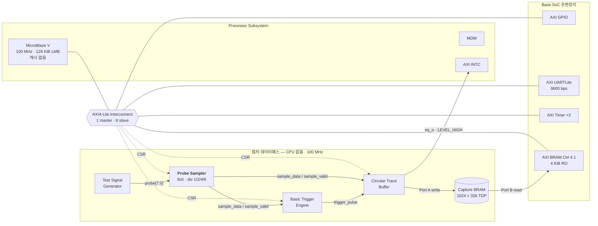

# EdgeScope-Lite SoC — 8채널 하드웨어 로직 애널라이저

> Basys3(Artix-7) + MicroBlaze V 위에 **직접 설계한 Custom IP 3종**으로 구현한
> standalone 로직 애널라이저. CPU 개입 없이 100 MHz 등간격으로 8채널을 샘플링하고,
> 트리거 시점을 중심으로 앞뒤 1,024 샘플을 하드웨어가 보존합니다.

<p>


</p>

**🎬 시연 영상 (1:57)** — <https://youtu.be/T0j1yjTDdGs>

---

## 이 저장소에 대하여

On-Device AI 3기 팀 프로젝트(**김도근 · 국승호 · 윤형욱**)의 결과물이며,
원본 팀 저장소는 **<https://github.com/yoon3226/EdgeScope-Lite-SoC>** 입니다.

이 저장소는 **김도근이 담당한 Probe Sampler IP 설계와 Vivado HW Platform 통합**을
중심으로 재구성한 개인 포트폴리오본입니다. 팀 전체 소스와 문서를 그대로 포함하되,
README와 [docs/my_contribution.md](docs/my_contribution.md)에서 담당 범위를 명시했습니다.
원본 팀 README는 [docs/original_team_readme.md](docs/original_team_readme.md)에 보존했습니다.

| 팀원 | 담당 |
|---|---|
| **김도근** | **Probe Sampler IP · Vivado HW Platform(Block Design) 통합 · Bitstream/XSA/구현 리포트** |
| 국승호 | Basic Trigger Engine IP · MicroBlaze 임베디드 소프트웨어 · UART 출력 |
| 윤형욱 | Circular Trace Buffer IP · Dual-Port BRAM 캡처 경로 |

---

## 1. 무엇을 해결했나

기존 방식으로 Basys3에서 디지털 신호를 관측하면 MicroBlaze가 AXI GPIO를 폴링합니다.
실측 처리량은 **1.67 Msamples/s(시연 조건 0.81 MS/s)** 수준이고, 샘플 간격이
소프트웨어 스케줄에 좌우되어 **등간격이 아닙니다.** 그 결과 **10 ns · 100 ns 펄스는
10회 중 0회 검출**됩니다.

EdgeScope-Lite는 관측 경로에서 CPU를 완전히 걷어냅니다.

|  | CPU Polling (기준군 A) | **EdgeScope-Lite (B)** |
|---|---|---|
| 샘플링 주체 | MicroBlaze 소프트웨어 | 전용 FPGA 하드웨어 |
| 샘플 레이트 | ~1.67 MS/s, 비등간격 | **100 MS/s, 등간격** |
| 100 ns 펄스 검출 | 0 / 10 | 검출 |
| 트리거 전 이력 | 없음 | **pre-trigger 512 샘플 보존** |

CPU는 AXI4-Lite로 설정하고 결과를 읽을 뿐, **캡처 데이터패스에는 관여하지 않습니다.**

---

## 2. 시스템 구조



Sampler 출력이 Trigger와 Buffer로 **갈라졌다가**, trigger pulse가 다시 Buffer로
들어오는 구조입니다. 세 IP는 같은 100 MHz 클럭에서 동작하며 각자 독립된
AXI4-Lite base address를 갖습니다.

**동결 사양 (Frozen v2.1 · [docs/day1_common_spec.md](docs/day1_common_spec.md))**

- 8-bit probe · 100 MHz · Divider 1/2/4/8
- Rising / Falling / Masked Pattern 트리거
- 1,024 × 32-bit dual-port BRAM
- pre-trigger 512 + 트리거 포함 post 512 → **트리거 논리 인덱스 항상 512**

---

## 3. 담당 파트 ① — Probe Sampler IP

> 전체 시스템에서 **모든 샘플 타이밍의 기준**을 만드는 입력단 IP입니다.
> Trigger Engine과 Trace Buffer가 이 IP의 `sample_valid`를 공통 기준으로 씁니다.

**소스** · [`rtl/core/probe_sampler.sv`](rtl/core/probe_sampler.sv) ·
[`rtl/bus/probe_sampler_axi.sv`](rtl/bus/probe_sampler_axi.sv) ·
[`sim/tb/tb_probe_sampler.sv`](sim/tb/tb_probe_sampler.sv) ·
[`ip_repo/probe_sampler_1_0/`](ip_repo/probe_sampler_1_0/)

### 3.1 설계 판단 — 분주 클럭을 만들지 않는다

1/2/4/8 분주가 필요하다고 해서 **새 클럭을 생성하지 않았습니다.** 대신 100 MHz
단일 클럭 안에서 **clock-enable 카운터**로 유효 샘플 시점만 선택합니다.

- 파생 클럭을 만들면 클럭 도메인이 늘어나 CDC와 타이밍 제약이 따라옵니다.
- 단일 클럭 도메인을 유지한 덕분에 시스템 전체 타이밍 클로저가 수월했습니다
  (최종 WNS **+0.832 ns**, 실패 엔드포인트 **0 / 9,845**).
- 하위 IP 두 개도 같은 클럭에서 `sample_valid`만 보면 되므로 IP 간 계약이 단순해집니다.

```systemverilog
// rtl/core/probe_sampler.sv — 분주는 클럭이 아니라 enable로 표현한다
2'b00: divider_terminal = 3'd0;  // ÷1  → 100   MS/s
2'b01: divider_terminal = 3'd1;  // ÷2  →  50   MS/s
2'b10: divider_terminal = 3'd3;  // ÷4  →  25   MS/s
default: divider_terminal = 3'd7; // ÷8  →  12.5 MS/s
```

### 3.2 런타임 분주 변경 시 위상 재시작

소프트웨어가 동작 중에 `DIVIDER_SEL`을 바꾸면, 남아 있던 카운터 값 때문에
**첫 주기만 비정상적으로 길거나 짧아지는** 문제가 생깁니다. 분주 선택값이 바뀐
사이클에 카운터를 0으로 되돌려 이를 차단했습니다.

```systemverilog
if (divider_sel_i != divider_sel_q) begin
    divider_count_q <= 3'd0;      // stale 카운터로 인한 첫 주기 왜곡 방지
    divider_sel_q   <= divider_sel_i;
end else if (!enable_i) begin
    divider_count_q <= 3'd0;
end else if (divider_count_q == divider_terminal(divider_sel_i)) begin
    sample_data_o  <= probe_i & channel_mask_i;   // 채널 마스킹
    sample_valid_o <= 1'b1;                       // 1-clock 유효 펄스
    sample_count_o <= sample_count_o + 32'd1;
end
```

`SOFT_CLEAR`는 write-one-pulse로 처리해 리셋 없이 카운터·샘플·유효 신호를
동기 초기화합니다.

### 3.3 AXI4-Lite 레지스터 맵

| Offset | Register | 접근 | 정의 |
|---:|---|---|---|
| `0x00` | `CONTROL` | RW / W1P | `[0] ENABLE`, `[1] SOFT_CLEAR` (W1P, read 0) |
| `0x04` | `CONFIG` | RW | `[1:0] DIVIDER_SEL`, `[15:8] CHANNEL_MASK` |
| `0x08` | `LAST_SAMPLE` | RO | `[7:0]` 최근 샘플 |
| `0x0C` | `SAMPLE_COUNT` | RO | `[31:0]` 누적 유효 샘플 수 |

wrapper는 AW/W 채널을 독립 래치해 **순서에 무관하게** 수락하고, 두 채널이 모두
모인 사이클에만 write를 커밋합니다. `WSTRB`를 바이트 단위로 존중해
`DIVIDER_SEL`(byte 0)과 `CHANNEL_MASK`(byte 1)를 따로 갱신할 수 있습니다.
B 채널이 backpressure를 걸어도 다음 write를 받지 않고 대기합니다.

레지스터 정의는 [`sw/include/logic_analyzer_regs.h`](sw/include/logic_analyzer_regs.h)와
공유하며, 오프셋·비트 위치가 어긋나면 **컴파일이 실패**하도록 정적 검사
([`sim/tb/check_logic_analyzer_regs.c`](sim/tb/check_logic_analyzer_regs.c))를
회귀 테스트에 넣었습니다.

---

## 4. 담당 파트 ② — Vivado HW Platform 통합

> 세 사람이 각자 만든 IP를 하나의 부팅 가능한 SoC로 합치고, Bitstream·XSA와
> 구현 리포트까지 만들어 소프트웨어 팀에 넘기는 역할입니다.

**소스** · [`comparison/edgescope_lite/hw/block_design.tcl`](comparison/edgescope_lite/hw/block_design.tcl) ·
[`comparison/edgescope_lite/hw/build_all.tcl`](comparison/edgescope_lite/hw/build_all.tcl) ·
[`comparison/common/base_soc.tcl`](comparison/common/base_soc.tcl) ·
[`scripts/package_frontend_ips.tcl`](scripts/package_frontend_ips.tcl) ·
[`scripts/validate_packaged_ip_bd.tcl`](scripts/validate_packaged_ip_bd.tcl)

### 4.1 통합 범위

- **IP 패키징** — 3개 Custom IP를 `ip_repo/`에 AXI4-Lite 슬레이브로 패키징
- **Block Design** — MicroBlaze V + 주변장치 4종 + Custom IP 3종 = 1 master / 8 slave
- **주소 배정** — IP별 독립 base address, Address Editor 확정값을 C 헤더와 동기화
- **BRAM 서브시스템** — True Dual-Port 1024×32b 생성, Port A(Buffer write) /
  Port B(AXI BRAM Controller, CPU read-only) 분리 배선
- **인터럽트** — Trace Buffer `irq_o` → AXI INTC In2, **LEVEL_HIGH**
- **산출물** — 합성·구현·Bitstream·XSA·Utilization/Timing/DRC 리포트, Bootable Bitstream
- **재현성** — 전 과정을 Tcl 스크립트화해 GUI 조작 없이 재빌드 가능

### 4.2 설계 선택 — MicroBlaze 캐시 비활성화

LMB 로컬 메모리 128 KiB만 쓰고 캐시를 껐습니다.
이 프로젝트는 **상태 레지스터 폴링**이 제어 흐름의 핵심입니다. 캐시가 있으면
AXI로 읽은 상태 값이 캐시에 고여 오래된 값을 돌려줄 수 있고, 명령어 실행 시간도
예측하기 어려워집니다. 관측 장비라는 성격상 예측 가능성을 택했습니다.

### 4.3 통합 단계에서만 드러난 결함

세 IP가 **각각은 사양대로 정확한데 합쳤을 때만** 깨지는 결함이 나왔습니다.
통합 검증이 왜 따로 필요한지 보여준 사례라 그대로 기록해 둡니다.

| 결함 | 증상 | 조치 |
|---|---|---|
| 패키징 IP의 BRAM 인터페이스 메모리 크기 기본값이 8 KiB | Block Design 파라미터 전파 단계에서 메모리 깊이가 **1024 → 2048**로 바뀌어 캡처 기하 구조 전체가 틀어짐. **시뮬레이션에서는 재현되지 않음** | 인터페이스 크기를 4 KiB로 고정하고, 전파된 깊이가 1024인지 [`scripts/validate_packaged_ip_bd.tcl`](scripts/validate_packaged_ip_bd.tcl)로 자동 검사 |
| Trigger ARM 순서 | Trace Buffer `PRE_READY` 이전에 Trigger를 ARM하면, PREFILL 구간 트리거는 Buffer가 무시하고 Trigger Engine은 원샷 래치되어 **캡처가 영원히 완료되지 않음** | 제어 순서를 공통 명세 v2.1에 필수 순서로 동결하고 회귀 테스트로 고정 |

통합 후 명세와 구현을 재대조하는 설계 감사에서 총 **9건**을 찾아 전부 수정했습니다.

### 4.4 구현 사인오프

| 항목 | 결과 |
|---|---|
| Block Design Validation | PASS |
| Setup WNS @100 MHz | **+0.832 ns** (TNS 0) |
| Hold WHS | **+0.028 ns** (THS 0) |
| 실패 엔드포인트 | **0 / 9,845** |
| DRC | Error 0 · Warning 5 |
| BRAM 사용 | 33 / 50 tiles |

리포트 원본 → [`comparison/edgescope_lite/reports/`](comparison/edgescope_lite/reports/)

---

## 5. 검증

### RTL 회귀 — 8/8 PASS

```bash
./scripts/run_regression.sh            # SystemVerilog TB 7건 + C 헤더 정적 검사 1건
./scripts/run_regression.sh --waves    # artifacts/waves/*.vcd 생성
```

사양 상수 · Sampler 동작 · 버퍼 기본 동작 · 트리거 정렬 · **wrap 경계** ·
ABORT/인터럽트 포함 제어 · AXI 프로토콜 · BRAM 1,024 워드 읽기 · C 헤더 계약.
파형 증거는 [`artifacts/waves/`](artifacts/waves/)에 커밋되어 있습니다.

### 보드 실측

Rising / Falling / Masked Pattern 세 모드 모두 트리거 샘플이 **논리 인덱스 512**에
정렬됨을 UART 덤프로 확인했습니다. 분주비를 바꿔 CLEAR 후 재ARM하는 **연속 캡처**와,
트리거가 끝내 오지 않을 때 타임아웃 → `ABORT`로 FSM을 IDLE로 되돌리는
**fail-safe 복구 경로**까지 검증했습니다.

---

## 6. A/B/C 비교 실험

같은 Vivado 2024.2 · 같은 Basys3 · 같은 100 MHz · **같은 테스트 패턴 발생기와
같은 Base SoC** 위에서 세 가지를 각각 구현하고 Implementation 리포트를 뽑았습니다.

| | A. CPU Polling | **B. EdgeScope-Lite** | C. Vivado ILA |
|---|---:|---:|---:|
| LUT | 2,782 | **3,205** | 3,726 |
| Register | 2,560 | **3,046** | 4,230 |
| BRAM tile | 32.0 | **33.0** | 32.5 |
| DSP | 0 | 0 | 0 |

절대값 대부분은 세 설계가 공유하는 **Base SoC 비용**입니다. 그래서 A를 빼서
순수 애널라이저 비용만 계산하면 슬라이스 **124 vs 604**, LUT **423 vs 944**,
Register **486 vs 1,670** (B vs C)이 됩니다.

> ⚠️ 이 baseline 차감 수치는 발표 시점 잠정값이며, 공식 Custom-vs-ILA 판정은
> `PENDING_CUSTOM` 상태입니다. 또한 A는 전용 캡처 하드웨어가 없는 소프트웨어
> 기준군이라 기능이 동등하지 않으므로, **절감률은 B와 C 사이에서만** 이야기합니다.

**불리한 점도 기록합니다** — 전용 캡처 BRAM을 쓰기 때문에 ILA보다 BRAM 타일을
0.5개 더 씁니다. 대신 Vivado Hardware Manager 없이 UART와 CSV만으로 결과를
확인할 수 있는 독립성을 얻었습니다.

각 비교군 재현 절차 → [`comparison/cpu_polling/`](comparison/cpu_polling/) ·
[`comparison/edgescope_lite/`](comparison/edgescope_lite/) ·
[`comparison/vivado_ila/`](comparison/vivado_ila/)

---

## 7. 빠른 시작

### GUI 시연 — Vivado도 Node.js도 필요 없음

```bash
python3 -m venv .venv
.venv/bin/pip install -r requirements-gui.txt
.venv/bin/python scripts/cpu_polling_gui.py --analyzer edgescope_lite
```

보드가 없어도 **데모 모드**로 화면을 확인할 수 있습니다. 이때 표시되는 값에는
`DEMO · 예상` 배지가 붙으며 실측값이 아닙니다.

### 하드웨어 재빌드 (Vivado / Vitis 2024.2)

```bash
./scripts/check_portable_environment.sh                 # 환경 점검
vivado -mode batch -source comparison/edgescope_lite/hw/build_all.tcl
python comparison/edgescope_lite/vitis/build_edgescope_lite.py
```

다른 PC 이관 절차는 [docs/portable_setup.md](docs/portable_setup.md)를 참조하세요.

---

## 8. 저장소 구조

```text
.
├── rtl/
│   ├── core/            Custom IP 3종 core (probe_sampler, basic_trigger_engine, circular_trace_buffer)
│   ├── bus/             IP별 AXI4-Lite wrapper
│   ├── include/         공통 package (logic_analyzer_pkg.sv)
│   └── top/             통합 및 supporting RTL
├── sim/tb/              IP별 testbench + C 헤더 정적 검사
├── ip_repo/             Vivado 패키징된 Custom IP
├── ip/capture_bram/     Block Memory Generator 설정 (.xci)
├── constraints/         XDC
├── scripts/             빌드 · 패키징 · 회귀 · GUI
├── sw/include/          Vitis 레지스터 헤더
├── comparison/
│   ├── common/          공통 Base SoC + 테스트 패턴 발생기
│   ├── cpu_polling/     비교군 A
│   ├── edgescope_lite/  비교군 B (본 설계)
│   └── vivado_ila/      비교군 C
├── dashboard/           Chrome Web Serial 파형 대시보드 (TypeScript/Vite)
├── artifacts/waves/     회귀 테스트 VCD
├── docs/                공통 명세 · 데이터시트 · 검증 리포트
└── presentation/        발표 슬라이드 · 대본
```

Vivado 캐시와 일반 생성물은 커밋하지 않습니다. 보드에서 즉시 실행 가능한
검증된 A/B/C Bootable Bitstream과 `artifacts/waves/*.vcd`만 예외로 포함합니다.

---

## 9. 문서

| 문서 | 내용 |
|---|---|
| [docs/my_contribution.md](docs/my_contribution.md) | **김도근 담당 범위 상세 — Probe Sampler 설계 결정과 HW 통합 기록** |
| [docs/day1_common_spec.md](docs/day1_common_spec.md) | 공통 명세 Frozen v2.1 — 레지스터 맵, 타이밍 계약 |
| [docs/portable_setup.md](docs/portable_setup.md) | 다른 PC에서 clone · 환경 점검 · 전체 재빌드 |
| [docs/verification_report.md](docs/verification_report.md) | Steps 1–9 감사/검증 리포트 |
| [docs/abc_demo_video_scenario.md](docs/abc_demo_video_scenario.md) | A/B/C 비교 시연 시나리오 |
| [presentation/script_full_31min.md](presentation/script_full_31min.md) | 발표 대본 (전체) |
| [docs/original_team_readme.md](docs/original_team_readme.md) | 원본 팀 README |

---

## 라이선스 · 크레딧

On-Device AI 3기 팀 프로젝트입니다. 원본 저장소는
<https://github.com/yoon3226/EdgeScope-Lite-SoC> 이며, Basic Trigger Engine과
임베디드 소프트웨어는 국승호, Circular Trace Buffer는 윤형욱이 설계했습니다.
