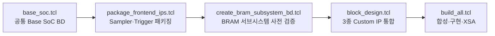

# 김도근 담당 상세 — Probe Sampler IP · HW Platform 통합

이 문서는 [`README.md`](../README.md) 3장(Probe Sampler IP)·4장(Vivado HW Platform
통합)이 요약만 한 부분을, 실제 RTL·테스트벤치·Tcl 스크립트 근거로 더 깊게
설명합니다. README와 중복되는 배경 설명은 반복하지 않고 코드·스크립트 라인을
직접 인용합니다.

담당 범위는 **Probe Sampler IP(core + AXI4-Lite wrapper) 설계**와 **Vivado HW
Platform(Block Design) 통합**입니다. Basic Trigger Engine과 임베디드
소프트웨어는 국승호, Circular Trace Buffer는 윤형욱 담당이며, 이 문서에서 그
두 IP의 내부 RTL을 설계 근거로 서술하지 않습니다. 다만 세 IP를 하나의 Block
Design으로 묶고 통합 검증 스크립트를 작성·실행한 부분은 담당 범위에 포함됩니다.

---

## 1. 담당 범위 요약

| 항목 | 산출물 파일 경로 |
|---|---|
| Probe Sampler core RTL | [`rtl/core/probe_sampler.sv`](../rtl/core/probe_sampler.sv) |
| Probe Sampler AXI4-Lite wrapper | [`rtl/bus/probe_sampler_axi.sv`](../rtl/bus/probe_sampler_axi.sv) |
| 공통 register/geometry 상수 (RTL측) | [`rtl/include/logic_analyzer_pkg.sv`](../rtl/include/logic_analyzer_pkg.sv) |
| 공통 register/geometry 상수 (SW측) | [`sw/include/logic_analyzer_regs.h`](../sw/include/logic_analyzer_regs.h) |
| Probe Sampler 단독 테스트벤치 | [`sim/tb/tb_probe_sampler.sv`](../sim/tb/tb_probe_sampler.sv) |
| Sampler+Trigger 프론트엔드 통합 테스트벤치 | [`sim/tb/tb_frontend_axi.sv`](../sim/tb/tb_frontend_axi.sv) |
| C 헤더 ↔ RTL 오프셋 정적 계약 검사 | [`sim/tb/check_logic_analyzer_regs.c`](../sim/tb/check_logic_analyzer_regs.c) |
| 패키징된 Custom IP | [`ip_repo/probe_sampler_1_0/`](../ip_repo/probe_sampler_1_0/) |
| 공통 Base SoC 빌드 | [`comparison/common/base_soc.tcl`](../comparison/common/base_soc.tcl) |
| Frontend(Sampler/Trigger) IP 패키징 | [`scripts/package_frontend_ips.tcl`](../scripts/package_frontend_ips.tcl) |
| BRAM 서브시스템 사전 검증 | [`scripts/create_bram_subsystem_bd.tcl`](../scripts/create_bram_subsystem_bd.tcl) |
| 패키징 IP 통합 BD 검증 | [`scripts/validate_packaged_ip_bd.tcl`](../scripts/validate_packaged_ip_bd.tcl) |
| Block Design 통합 | [`comparison/edgescope_lite/hw/block_design.tcl`](../comparison/edgescope_lite/hw/block_design.tcl) |
| 합성·구현·Bitstream/XSA 빌드 | [`comparison/edgescope_lite/hw/build_all.tcl`](../comparison/edgescope_lite/hw/build_all.tcl) |
| 구현 리포트 원본 | [`comparison/edgescope_lite/reports/`](../comparison/edgescope_lite/reports/) |

---

## 2. Probe Sampler IP

### 2.1 인터페이스 계약

`probe_sampler.sv` core 포트는 다음과 같습니다.

| 이름 | 방향 | 폭 | 의미 |
|---|---|---:|---|
| `clk_i` | input | 1 | 100 MHz 시스템 클럭 |
| `rst_ni` | input | 1 | 동기 active-low reset |
| `probe_i` | input | 8 | 원본 probe 입력 |
| `enable_i` | input | 1 | sampler enable |
| `soft_clear_i` | input | 1 | 1-clock 동기 clear pulse |
| `divider_sel_i` | input | 2 | 분주 선택 (÷1/÷2/÷4/÷8) |
| `channel_mask_i` | input | 8 | 채널 enable 마스크 |
| `sample_data_o` | output | 8 | `probe_i & channel_mask_i` (등록 출력) |
| `sample_valid_o` | output | 1 | 새 sample을 나타내는 1-clock pulse |
| `sample_count_o` | output | 32 | 누적 valid sample 수 |

`sample_valid_o`는 이 IP 하나만의 출력이 아니라 하위 두 IP가 공유하는 공통
타이밍 기준입니다. `basic_trigger_engine`과 `circular_trace_buffer`는 각자
`sample_data_i`/`sample_valid_i`로 이 신호를 그대로 받아, `sample_valid_o=1`인
사이클에만 자신의 상태를 갱신합니다. Sampler가 "언제가 유효한 샘플 시점인가"를
결정하면 나머지 두 IP는 그 판단을 다시 계산하지 않고 따릅니다.

### 2.2 마이크로아키텍처

`probe_sampler.sv`는 하나의 `always_ff` 블록 안에서 개념적으로 4개 블록이
동작합니다.

1. **Clock Enable Divide** — `divider_count_q`와 `divider_terminal()` 함수가
   분주비를 결정합니다. 100 MHz 클럭 자체는 그대로 두고, 몇 클럭마다 한 번
   유효 샘플을 낼지만 카운터로 고릅니다.
2. **Sampler & Mask** — terminal count에 도달한 사이클에만
   `probe_i & channel_mask_i`를 `sample_data_o`에 등록합니다.
3. **Sample Valid Generator** — 매 클럭 `sample_valid_o`를 0으로 내렸다가,
   terminal count에 도달한 사이클에만 1로 등록합니다(1-clock pulse).
4. **Sample Counter** — `sample_valid_o`가 세워지는 사이클에만
   `sample_count_o`를 1 증가시킵니다.

네 블록 모두 `always_ff @(posedge clk_i)` 안에서 값을 만들고 그대로
출력하므로, `sample_data_o`/`sample_valid_o`/`sample_count_o`에는 조합 경로가
없습니다. `divider_terminal()`은 `automatic function`으로 다음 상태를 계산하는
용도로만 쓰이고, 출력 포트를 직접 구동하지 않습니다.

```systemverilog
// rtl/core/probe_sampler.sv:19-28
function automatic logic [2:0] divider_terminal (
    input logic [1:0] divider_sel
);
    case (divider_sel)
        2'b00: divider_terminal = 3'd0; // Divide by 1
        2'b01: divider_terminal = 3'd1; // Divide by 2
        2'b10: divider_terminal = 3'd3; // Divide by 4
        default: divider_terminal = 3'd7; // Divide by 8
    endcase
endfunction
```

| `divider_sel_i` | 분주비 | terminal count | 유효 샘플 주기 |
|---:|---:|---:|---:|
| `2'b00` | ÷1 | 0 | 100 MS/s |
| `2'b01` | ÷2 | 1 | 50 MS/s |
| `2'b10` | ÷4 | 3 | 25 MS/s |
| `2'b11` | ÷8 | 7 | 12.5 MS/s |

### 2.3 경계 조건 처리

**런타임 divider 변경 시 위상 재시작.** 동작 중 `DIVIDER_SEL`이 바뀌면 이전
분주비로 쌓인 `divider_count_q`가 새 terminal count 기준으로는 무의미해져
첫 주기만 비정상적으로 길거나 짧아집니다.

```systemverilog
// rtl/core/probe_sampler.sv:49-51
if (divider_sel_i != divider_sel_q) begin
    divider_count_q <= 3'd0;
    divider_sel_q   <= divider_sel_i;
```

`tb_probe_sampler.sv`의 `test_runtime_divider_change`가 divide-by-8→2 전환으로
이 동작을 검증합니다(2.5절).

**`enable_i` 해제 시 카운터 0 복귀.** enable이 꺼진 동안 카운터가 계속 돌면
재개 시점 위상이 disable 이전과 무관해집니다. enable이 꺼져 있는 한 매 클럭
카운터를 0으로 고정해, 재개 첫 클럭부터 항상 같은 위상으로 시작합니다.

```systemverilog
// rtl/core/probe_sampler.sv:52-53
end else if (!enable_i) begin
    divider_count_q <= 3'd0;
```

**`soft_clear_i` 동기 초기화(write-one-pulse).** core는 `soft_clear_i=1`인
사이클에 `divider_count_q`/`sample_data_o`/`sample_valid_o`/`sample_count_o`를
reset과 동일하게 초기화합니다(`rtl/core/probe_sampler.sv:37-42`). 이 입력을
레벨이 아니라 1-clock pulse로 만드는 책임은 AXI wrapper에 있습니다.
`probe_sampler_axi.sv`는 매 클럭 `soft_clear_pulse_q`를 0으로 내렸다가,
`CONTROL`에 `SOFT_CLEAR` 비트가 담긴 write가 커밋되는 그 사이클에만 1로
세웁니다.

```systemverilog
// rtl/bus/probe_sampler_axi.sv:94-99
soft_clear_pulse_q <= 1'b0;
if (write_commit && awaddr_q == SAMPLER_REG_CONTROL &&
    wstrb_q[0]) begin
    enable_q           <= wdata_q[0];
    soft_clear_pulse_q <= wdata_q[1];
end
```

소프트웨어는 별도 clear-then-clear 시퀀스 없이 `CONTROL` write 한 번으로
정확히 한 클럭만 clear를 걸 수 있고, read 시 이 비트는 항상 0으로 보이므로
"clear가 아직 걸려 있는지"를 잘못 폴링할 여지가 없습니다.

### 2.4 AXI4-Lite Wrapper

**AW/W 채널 독립 래치.** `s_axi_awvalid`와 `s_axi_wvalid`가 같은 사이클에
오리라 가정하지 않고, 두 채널을 각각 `aw_valid_q`/`w_valid_q`로 독립 래치한
뒤 둘 다 도착한 사이클에만 커밋합니다.

```systemverilog
// rtl/bus/probe_sampler_axi.sv:53-55
assign s_axi_awready = !aw_valid_q && !bvalid_q;
assign s_axi_wready  = !w_valid_q && !bvalid_q;
assign write_commit  = aw_valid_q && w_valid_q && !bvalid_q;
```

**`WSTRB` 바이트 단위 존중.** `CONFIG` 레지스터는 byte 0에 `DIVIDER_SEL`, byte
1에 `CHANNEL_MASK`가 들어 있습니다. `wstrb_q[0]`와 `wstrb_q[1]`을 따로 확인해,
한쪽 바이트만 쓰는 AXI transaction이 다른 쪽 필드를 건드리지 않도록 합니다.

```systemverilog
// rtl/bus/probe_sampler_axi.sv:100-105
if (write_commit && awaddr_q == SAMPLER_REG_CONFIG) begin
    if (wstrb_q[0])
        divider_sel_q <= wdata_q[1:0];
    if (wstrb_q[1])
        channel_mask_q <= wdata_q[15:8];
end
```

**B 채널 backpressure.** `bvalid_q`는 커밋 시 세워지고 `s_axi_bready`가 올 때까지
내려가지 않으며, `s_axi_awready`/`s_axi_wready`가 `!bvalid_q`를 포함하므로
master가 이전 write 응답을 받기 전에는 다음 AW/W를 수락하지 않습니다
(`rtl/bus/probe_sampler_axi.sv:53-54, 81-83`).

**읽기 경로.** `always_comb`으로 `s_axi_araddr`를 레지스터 오프셋에 맞춰
디코드한 뒤(`rtl/bus/probe_sampler_axi.sv:122-138`), 그 결과를 `rdata_q`에
등록하고 `rvalid_q`를 세워 `s_axi_rvalid`/`s_axi_rready` 핸드셰이크로
내보냅니다.

```systemverilog
// rtl/bus/probe_sampler_axi.sv:150-155
if (s_axi_arready && s_axi_arvalid) begin
    rdata_q  <= read_data;
    rvalid_q <= 1'b1;
end else if (rvalid_q && s_axi_rready) begin
    rvalid_q <= 1'b0;
end
```

### 2.5 검증

**`tb_probe_sampler.sv`** — self-checking 테스트벤치이며 다음을 검사합니다.

- `apply_reset` — reset 중 valid/count/data가 모두 0으로 유지되는지.
- `pulse_soft_clear` — clear pulse 한 클럭 만에 valid/count/data가 0으로
  되돌아가는지.
- `test_divider(divider_sel, divider)` — ÷1/÷2/÷4/÷8 각각에 대해
  `channel_mask_i=8'hA5` 상태로 `divider*4` 클럭을 돌리며 매 클럭 기대
  valid(`cycle % divider == 0`)·기대 count·기대
  `sample_data_o == probe_i & channel_mask_i`를 비교하고, `enable_i`를 내린
  뒤 3클럭 동안 상태가 그대로인지도 확인합니다.
- `test_runtime_divider_change` — ÷8 도중 terminal count 전에 `divider_sel_i`를
  ÷2로 바꿔, 변경 사이클엔 spurious valid가 없고 정확히 두 클럭 뒤에만
  valid가 서며 값이 새 분주비 기준으로 맞는지 확인합니다(2.3절 검증).
- 마지막으로 `pulse_soft_clear`를 다시 호출해 count가 0으로 돌아오는지
  재확인합니다.

**`tb_frontend_axi.sv`** — Sampler와 Trigger를 각자의 AXI4-Lite wrapper로
인스턴스화하고, `sample_data_o`/`sample_valid_o`를 `basic_trigger_engine_axi`의
`sample_data_i`/`sample_valid_i`에 직결한 프론트엔드 통합 테스트벤치입니다.
개별 IP 단위 TB와 달리, **AXI CSR을 통해서만** 두 IP를 설정하고 그 설정이
end-to-end로 맞물리는지를 봅니다.

- Rising edge 시나리오 — Sampler `CONFIG`로 채널 마스크를 세팅하고 soft-clear
  후 enable, Trigger를 `RISING` 모드로 clear→arm한 뒤 `probe`를 0→1로 올려
  트리거 발생을 확인합니다. Trigger `STATUS`(`ARMED|TRIGGERED`)와
  `TRIGGER_COUNT=1`, TB 자체 카운터 `pulse_count=1`, Sampler
  `LAST_SAMPLE`/`SAMPLE_COUNT` 갱신까지 AXI read로 확인합니다.
- Pattern entry 시나리오 — Trigger를 `PATTERN` 모드(`value=0xa0, mask=0xf0`)로
  재설정하고 `probe=0xa5`를 유지한 채 몇 클럭을 더 흘려, 진입 시점에 정확히
  한 번만 추가 트리거가 나고(`TRIGGER_COUNT=2`, `pulse_count=2`) 값을
  유지하는 동안 재트리거되지 않는지 확인합니다.

즉 이 TB는 Sampler 단독 동작이 아니라, 제가 만든 `sample_valid_o`/
`sample_data_o` 계약을 다른 팀원의 Trigger Engine이 AXI로 설정된 상태에서도
정확히 소비하는지를 검증합니다.

**`check_logic_analyzer_regs.c`** — `logic_analyzer_regs.h`를 include해
컴파일하는 C 파일로, `_Static_assert`를 통해 spec 버전과 `TRACE_REG_*` 오프셋/
비트, 세 IP가 공유하는 capture geometry 상수(`EDGE_SCOPE_CAPTURE_DEPTH=1024`,
`PRE/POST_SAMPLES=512`, `TRIGGER_INDEX=512` 등)를 컴파일 타임에 고정합니다.
`SAMPLER_REG_*` 오프셋 자체에 대한 개별 assert는 이 파일에 없지만, 컴파일되려면
`sw/include/logic_analyzer_regs.h` 전체가 `rtl/include/logic_analyzer_pkg.sv`와
어긋나지 않아야 하고, Sampler 레지스터 맵이 의존하는 geometry 상수가 깨지면 이
assert가 먼저 실패합니다. `scripts/run_regression.sh`는 이 파일을
SystemVerilog TB들과 같은 목록에서 컴파일해, RTL 상수와 C 헤더가 갈라지는
순간 빌드가 깨지도록 강제합니다.

---

## 3. Vivado HW Platform 통합

### 3.1 빌드 파이프라인



- **`base_soc.tcl`** — MicroBlaze V + 주변장치 4종만 있는 공통 Base SoC를
  생성하고 각 IP 설정값·주소·클럭/리셋 배선을 `assert_equal`/`assert_address`로
  자체 검증합니다. 산출물은
  `comparison/common/build/base_soc/edgescope_comparison_base.xpr`(안에
  `base_soc.bd`)와 `comparison/common/generated/base_soc_generated.tcl`입니다.
- **`package_frontend_ips.tcl`** — Probe Sampler와 Basic Trigger Engine 두
  프론트엔드 AXI4-Lite IP를 `ipx::package_project`로 패키징합니다. Circular
  Trace Buffer는 별도 스크립트(`scripts/package_trace_buffer_ip.tcl`)로
  윤형욱이 패키징하므로 여기 포함되지 않습니다. 산출물은
  `ip_repo/probe_sampler_1_0/`과 `ip_repo/basic_trigger_engine_1_0/`입니다.
- **`create_bram_subsystem_bd.tcl`** — 스크립트 자체 주석대로 "이 Catalog IP
  연결이 팀 BD로 복사되기 전에" AXI BRAM Controller ↔ capture BMG 배선과 BRAM
  파라미터 전파를 독립적으로 먼저 검증하는 사전 점검 BD입니다.
- **`block_design.tcl`** — Base SoC를 열어 `save_project_as`로 복제한 뒤 3종
  Custom IP·capture BRAM·`axi_bram_ctrl`을 얹고 주소를 배정합니다. 산출물은
  `comparison/edgescope_lite/hw/build/edgescope_lite_reference.xpr`,
  `base_soc_wrapper` top, `edgescope_lite_generated.tcl`입니다.
- **`build_all.tcl`** — 위 프로젝트를 열어 `synth_1`→`impl_1`(bitstream까지)을
  실행하고 `report_utilization`/`report_timing_summary`/`report_drc`를
  `comparison/edgescope_lite/reports/`에 쓴 뒤 `write_hw_platform -fixed
  -include_bit`로 고정 XSA를 만듭니다.

`scripts/validate_packaged_ip_bd.tcl`은 이 5단계 주 파이프라인과 별도로,
패키징된 IP(주로 circular_trace_buffer)와 BRAM 서브시스템의 통합 시나리오만
따로 재현해 검증하는 스크립트입니다(3.3절).

### 3.2 Block Design 구성

| 구분 | 구성요소 | 근거 |
|---|---|---|
| Base SoC | MicroBlaze V (`microblaze_riscv_0`) | `comparison/common/base_soc.tcl:215-216` |
| Base SoC | MDM(Debug), AXI INTC | `apply_bd_automation` `debug_module {Debug Enabled}` / `axi_intc {1}` (`base_soc.tcl:218-230`) |
| Base SoC | Clocking Wizard (`clk_wiz`, 100 MHz) | `base_soc.tcl:198-210` |
| Base SoC | AXI GPIO(테스트 제어), AXI UARTLite(9600bps), AXI Timer×2 | `base_soc.tcl:241-265` |
| Custom IP | Probe Sampler (`probe_sampler_0`) | `block_design.tcl:66-67` |
| Custom IP | Basic Trigger Engine (`basic_trigger_engine_0`) | `block_design.tcl:68-69` |
| Custom IP | Circular Trace Buffer (`circular_trace_buffer_0`) | `block_design.tcl:70-71` |
| Custom IP | Capture BRAM (`blk_mem_gen:8.4`, TDP 1024×32) | `block_design.tcl:85-102` |
| Custom IP | `axi_bram_ctrl:4.1` (Port B, single-port 32-bit read) | `block_design.tcl:104-109` |

**주소 맵.** `block_design.tcl`이 Base SoC에 실제로 `assign_bd_address`한
값입니다.

| Offset | Range | 대상 |
|---:|---:|---|
| `0x40010000` | `0x00001000` | `probe_sampler_0/s_axi/reg0` |
| `0x40020000` | `0x00001000` | `basic_trigger_engine_0/s_axi/reg0` |
| `0x40030000` | `0x00001000` | `circular_trace_buffer_0/s_axi/reg0` |
| `0x42000000` | `0x00001000` | `axi_bram_ctrl_capture/S_AXI/Mem0` (capture 4 KiB) |

```tcl
# comparison/edgescope_lite/hw/block_design.tcl:155-165
set data_space [get_bd_addr_spaces microblaze_riscv_0/Data]
foreach {offset range segment} {
  0x40010000 0x00001000 probe_sampler_0/s_axi/reg0
  0x40020000 0x00001000 basic_trigger_engine_0/s_axi/reg0
  0x40030000 0x00001000 circular_trace_buffer_0/s_axi/reg0
  0x42000000 0x00001000 axi_bram_ctrl_capture/S_AXI/Mem0
```

Local memory(`0x00000000`)·GPIO(`0x40000000`)·UART(`0x40600000`)·INTC
(`0x41200000`)·Timer(`0x41C00000`)는 `base_soc.tcl`에서 이미 고정된 값이고,
`block_design.tcl`은 그 위에 네 개의 slave를 추가로 배정합니다.

**BRAM Port A/B 분리 배선.** 캡처 쓰기 경로와 CPU 읽기 경로가 물리적으로 다른
포트를 씁니다.

```tcl
# comparison/edgescope_lite/hw/block_design.tcl:111-116
connect_bd_intf_net \
  [get_bd_intf_pins $trace/BRAM_PORTA] \
  [get_bd_intf_pins $capture_bram/BRAM_PORTA]
connect_bd_intf_net \
  [get_bd_intf_pins $bram_ctrl/BRAM_PORTA] \
  [get_bd_intf_pins $capture_bram/BRAM_PORTB]
```

**IRQ 연결.** Trace Buffer의 `irq_o`를 AXI INTC 앞단 `xlconcat`의 `In2`에
연결하고, 포트 수를 3으로 늘립니다.

```tcl
# comparison/edgescope_lite/hw/block_design.tcl:151-153
set concat [get_bd_cells microblaze_riscv_0_xlconcat]
set_property CONFIG.NUM_PORTS {3} $concat
connect_bd_net [get_bd_pins $trace/irq_o] [get_bd_pins $concat/In2]
```

`irq_o`가 pulse가 아니라 `LEVEL_HIGH` 인터럽트로 동작하도록 `SENSITIVITY`를
IP-XACT에 지정하는 작업 자체는 Circular Trace Buffer 패키징 쪽(윤형욱 담당)의
몫이며, `block_design.tcl`은 그 level 신호를 그대로 INTC concat에 배선하는
역할입니다.

### 3.3 IP 패키징에서 겪은 문제

**증상.** `ip/capture_bram/capture_bram.xci`에 남은 기본 propagation 결과를
보면 BRAM 외부 interface(`BRAM_PORTA`)의 메모리 크기 기본값이
`MEM_SIZE=8192`(bytes, 8 KiB)로 잡혀 있습니다. 이 기본값을 그대로 두면 Block
Design 파라미터 전파 단계에서 `blk_mem_gen`의 `Write_Depth_A`가 `1024`가 아니라
`2048`로 바뀌어 캡처 기하 구조(1,024워드, pre/post 512, trigger index 512)
전체가 깨집니다.

**대응.** `block_design.tcl`은 `validate_bd_design` 직후 propagation 결과를
직접 읽어 강제로 확인합니다.

```tcl
# comparison/edgescope_lite/hw/block_design.tcl:169-176
# Propagation must not silently double the 1,024-word capture BRAM.
set propagated_depth [get_property CONFIG.Write_Depth_A $capture_bram]
if {$propagated_depth != 1024} {
  error "Capture BRAM depth=$propagated_depth, expected=1024"
}
```

같은 검사를 `create_bram_subsystem_bd.tcl`(단독 BRAM 서브시스템 BD)과
`validate_packaged_ip_bd.tcl`(패키징된 IP를 실제로 얹은 BD)에도 각각 넣어
이중으로 막습니다.

`validate_packaged_ip_bd.tcl`은 BD 파라미터 확인에서 그치지 않습니다. 새
프로젝트에 `ip_repo_paths`를 등록하고 패키징된 `circular_trace_buffer` IP가
카탈로그에 정확히 하나만 존재하는지 확인한 뒤, `trace_buffer_0` →
`capture_bram`(TDP 1024×32) → `axi_bram_ctrl_0`로 이어지는 최소 BD를 구성하고
AXI/`sample_data_i`/`sample_valid_i`/`trigger_pulse_i`/`irq_o`를 외부 포트로
뽑아 두 개의 독립 주소 공간(`TRACE_S_AXI`, `MEMORY_S_AXI`)에 4 KiB씩 배정합니다.
`validate_bd_design` 후 `propagated_depth==1024`를 확인하는 데서 멈추지 않고
실제로 `launch_runs synth_1`까지 돌려, 합성 netlist에 `RAMB36E1`이 정확히
1개인지도 셉니다(`scripts/validate_packaged_ip_bd.tcl:137-141`). BD 파라미터만
맞고 실제 합성에서 BRAM이 중복 인스턴스화되는 경우까지 잡기 위한 단계입니다.

**교훈.** `probe_sampler.sv`/`circular_trace_buffer`의 RTL 시뮬레이션은
`blk_mem_gen`의 IP-XACT interface metadata(`MEM_SIZE`)를 전혀 거치지 않기
때문에, 이 결함은 시뮬레이션 회귀에서 재현되지 않고 **Block Design 파라미터
전파 단계에서만** 나타납니다. 개별 IP가 사양대로 정확해도 Vivado Block
Automation이 IP 간에 전파하는 metadata까지 통합 단계에서 별도로 assert하지
않으면 발견할 수 없는 결함 클래스라서, `block_design.tcl`과 전용 검증
스크립트 두 곳에 동일한 `propagated_depth != 1024` 가드를 중복해 넣었습니다.

### 3.4 재현성

전 과정이 GUI 조작 없이 Tcl batch로 재현됩니다. 실제로 순서대로 실행하는
커맨드는 다음과 같습니다.

```bash
vivado -mode batch -source comparison/common/base_soc.tcl
vivado -mode batch -source scripts/package_frontend_ips.tcl
vivado -mode batch -source scripts/create_bram_subsystem_bd.tcl
vivado -mode batch -source comparison/edgescope_lite/hw/block_design.tcl
vivado -mode batch -source comparison/edgescope_lite/hw/build_all.tcl
```

마지막 `build_all.tcl`이 `report_timing_summary`/`report_drc`/
`report_utilization`을 생성하는 지점(`comparison/edgescope_lite/hw/build_all.tcl:43-47`)에서
나온 사인오프 결과가 Setup WNS **+0.832 ns**, Hold WHS **+0.028 ns**, 실패
엔드포인트 **0 / 9,845**, DRC Error **0** / Warning **5**, BRAM 사용
**33 / 50 tiles**입니다. 원본 리포트는
[`comparison/edgescope_lite/reports/`](../comparison/edgescope_lite/reports/)에
그대로 커밋돼 있습니다.

---

## 4. 배운 것

- 조합 경로를 아예 배제하고 4개 논리 블록을 하나의 `always_ff`로 등록
  출력만 내보내는 설계는, 분주비를 런타임에 바꾸거나 enable을 토글해도
  "다음 클럭에 무엇이 일어날지"를 always_comb 없이 한 곳에서 추론할 수 있게
  해줘서 경계 조건(위상 재시작, disable 시 카운터 정지)을 빠뜨리기 어렵게
  만들었습니다.
- AXI4-Lite write는 AW/W가 같은 사이클에 온다고 가정하면 안 되고, 두 채널을
  독립적으로 래치한 뒤 둘 다 모인 사이클에만 커밋해야 한다는 것을 wrapper를
  직접 짜면서 다시 확인했습니다.
- IP 단위 테스트벤치가 전부 통과해도, 그 IP가 다른 IP와 AXI로 실제로 맞물리는
  경로(`tb_frontend_axi.sv`)를 따로 두지 않으면 "레지스터 오프셋은 맞는데
  타이밍 계약이 어긋나는" 종류의 버그를 놓칠 수 있습니다.
- Block Design 파라미터 전파는 RTL 시뮬레이션이 전혀 보지 못하는 영역이라서,
  IP-XACT interface metadata에 의존하는 값(BRAM `MEM_SIZE` 등)은 `validate_bd_design`
  직후 스크립트로 명시적으로 assert하지 않으면 통합 단계까지 조용히 깨진 채로
  넘어갈 수 있습니다.
- 모든 통합 단계를 Tcl batch 스크립트로만 구성해 두면, 같은 결함을 여러
  스크립트(BD 통합, 사전검증 BD, 패키징 검증 BD)에 동일한 assertion으로
  중복 방어할 수 있고, 재현 여부를 사람이 GUI로 다시 눌러보지 않아도 됩니다.
